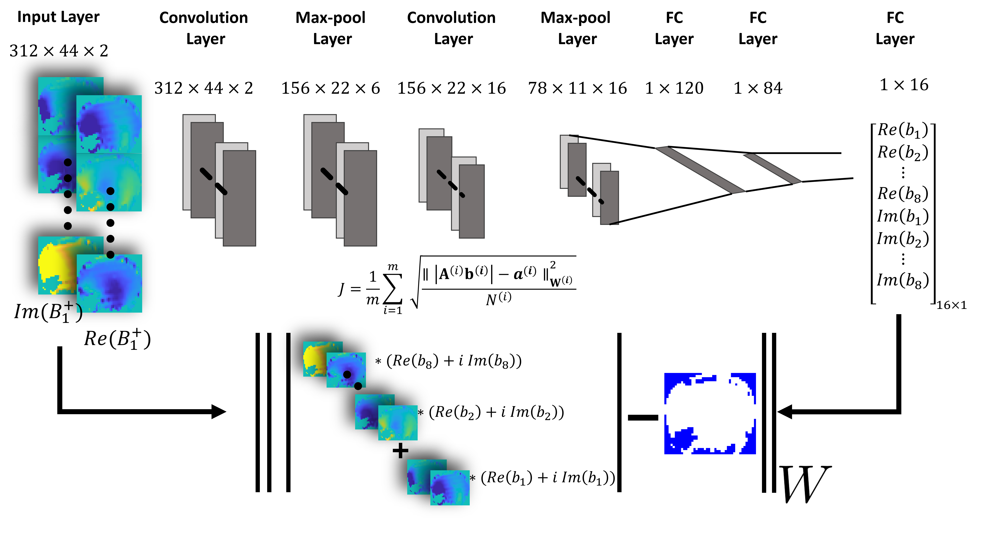

# Unsupervised Deep Learning with Convolutional Neural Networks for Static Parallel Transmit Design: A Retrospective Study

This is an implementation of Unsupervised DL with CNN for Static pTx (Kilic et al 2024).

## Dependencies
- Python 3.x
- [PyTorch](https://pytorch.org/) 
- numpy
- Mat73 (to load MATLAB .mat files)

## License
© 2024 Regents of the University of Minnesota

"*Unsupervised Deep Learning with Convolutional Neural Networks for Static Parallel Transmit Design: A Retrospective Study*" is copyrighted by Regents of the University of Minnesota. Regents of the University of Minnesota will license the use of "*Unsupervised Deep Learning with Convolutional Neural Networks for Static Parallel Transmit Design: A Retrospective Study*" solely for educational and research purposes by non-profit institutions and US government agencies only. For other proposed uses, contact [umotc@umn.edu](umotc@umn.edu). The software may not be sold or redistributed without prior approval. One may make copies of the software for their use provided that the copies, are not sold or distributed, are used under the same terms and conditions. As unestablished research software, this code is provided on an "as is'' basis without warranty of any kind, either expressed or implied. The downloading, or executing any part of this software constitutes an implicit agreement to these terms. These terms and conditions are subject to change at any time without prior notice.

**How to cite this article:**

Kilic T, Liebig P, Demirel OB, et al. Unsupervised deep learning with convolutional neural networks for static parallel transmit design: A retrospective study. *Magn Reson Med*. 2024;1-10. doi: 10.1002/mrm.30014

## Questions
If you have any questions, feel free to open an issue or contact kili0040@umn.edu